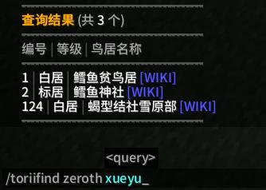
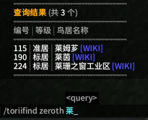
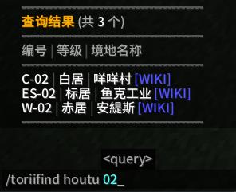
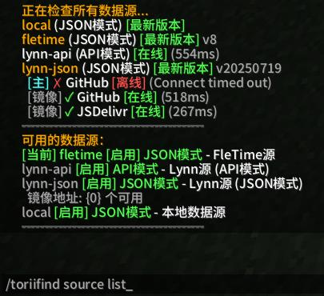

# ToriiFind

这是一个为 `Minecraft` 服务器 `Ria Zth` 设计的简单 Fabric Mod，
可以让玩家通过简单的指令，**快速查询服务器内零洲的鸟居信息和后土的境地信息**，并支持多数据源自动更新数据、拼音模糊搜索等功能。

---

## 效果演示




> 通过名称查询零洲鸟居



> 通过编号查询后土境地



> 数据源

---

## 主要特性

- **智能查询**：支持按编号、名称、拼音关键字一键查询零洲鸟居和后土境地的信息。
- **多数据源支持**：可自由切换本地/云端多种数据源，数据源会自动更新鸟居信息数据。
- **多语言支持**：内置简体中文、繁体中文、英文语言文件。
- **拼音模糊搜索**：支持中文名称的拼音模糊匹配。

---

## 指令列表

- `/toriifind help`  
  显示指令信息和用法说明

- `/toriifind zeroth <编号或关键字>`  
  智能查询零洲鸟居（支持编号、名称、拼音）

- `/toriifind houtu <编号或关键字>`  
  智能查询后土境地（支持编号、名称、拼音）

- `/toriifind source list`  
  列出所有可用的数据源

- `/toriifind source switch <name>`  
  切换当前数据源

- `/toriifind source current`  
  显示当前使用的数据源

- `/toriifind source check`  
  检查所有数据源的状态和更新

- `/toriifind source reload`  
  重新加载配置文件

- `/toriifind ciallo`  
  发送 Ciallo～(∠・ω< )⌒☆ 到公屏

---

## 数据源说明

- **local**  
  只使用本地 `toriifind.json` 文件作为数据源，随 Mod 本体一块更新。

- **fletime**  
  由 FleTime 维护的云端 JSON 数据源，存放在 [RIA Wiki](https://wiki.ria.red/wiki/%E7%94%A8%E6%88%B7:FleTime/toriifind.json?action=raw)，新鸟居共鸣后手动更新，为默认数据源。

- **lynn-json**  
  由 Venti_Lynn 维护的云端 JSON 数据源，每周进行一次更新。

- **lynn-api**  
  由 Venti_Lynn 维护的在线 API 数据源 [Github](https://github.com/RainC7/RIA_Data)，每天进行一次更新。

---

## 使用示例

### 查询零洲鸟居（日沉阁）

- 按编号查询（支持自动合并名称模糊匹配）：
  ```
  /toriifind zeroth 25
  ```

- 按名称关键字或拼音查询：
  ```
  /toriifind zeroth 阁
  /toriifind zeroth gerichenge
  ```

### 查询后土境地（安緹斯）

- 按编号查询（支持自动合并名称模糊匹配）：
  ```
  /toriifind houtu 02
  ```

- 按名称关键字或拼音查询：
  ```
  /toriifind houtu 安
  /toriifind houtu antisi
  ```

---

## 更新日志

### v2.0.4
- 修复配置文件编码问题

### v2.0.3
- 增加本地数据源 `local`
- `/toriifind source switch` 支持自动补全可用数据源
- 查询参数合并为智能输入，自动判断编号/名称/拼音

### v2.0.2
- 支持多数据源切换
- 支持从云端获取鸟居数据来自动更新

### v1.1.x 及更早
- 多语言支持
- 支持使用拼音模糊搜索鸟居/境地名称
- 美化了信息输出
- 支持了 1.20.x 版本

---

## 许可证

本项目采用 [CC0-1.0](LICENSE) 许可证。